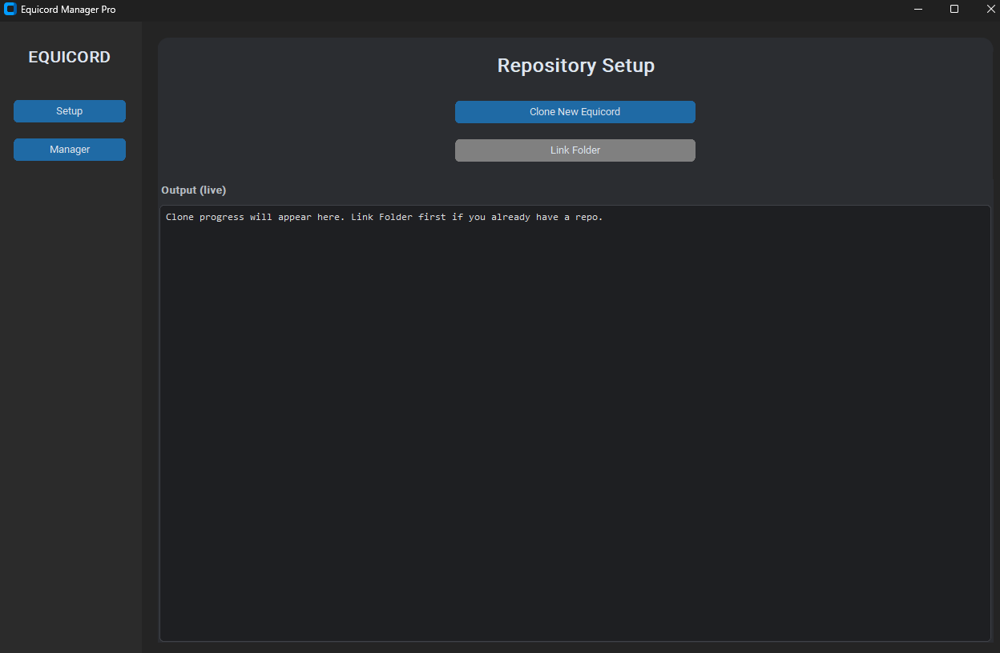
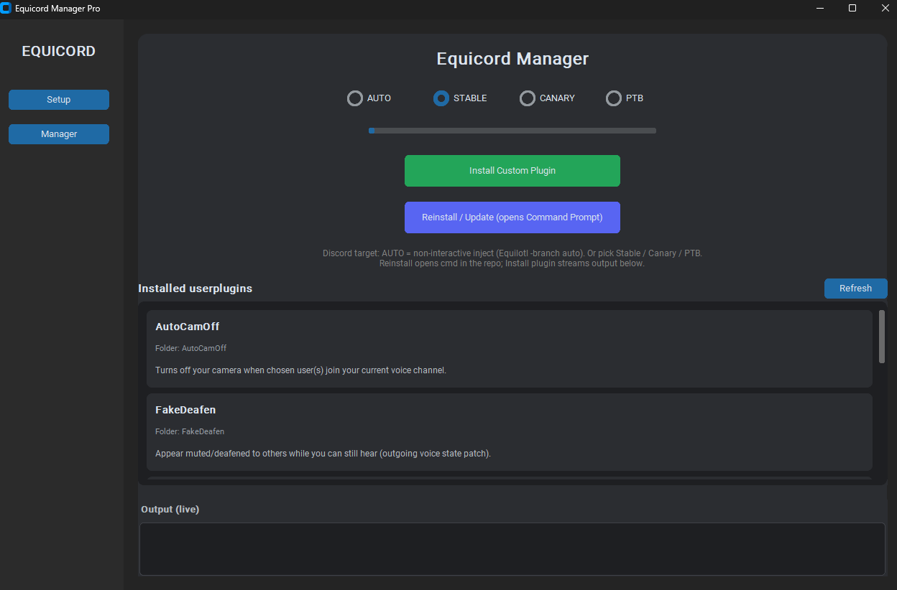

# Equicord Plugin Installer

GUI helper for [Equicord](https://github.com/Equicord/Equicord): link or clone the repo, install custom **userplugins**, build, and inject with **Equilotl** (live log, saved folder, `-branch` for non-interactive inject).

> **Disclaimer:** Third-party client modifications may violate Discord’s Terms of Service. Use at your own risk.

---

## **DOWNLOAD THE WINDOWS APP (`.exe`)**

### **→ [CLICK HERE — GitHub Releases → download `EquicordManager.exe`](https://github.com/jacobeyebrow/equicord-plugin-installer/releases/latest)**

**On that page:** open the **latest** release → scroll to **Assets** → download **`EquicordManager.exe`**.

*(No release yet? **Actions** → **Build Windows exe** → **Artifacts** → `EquicordManager-Windows`, or see **Requirements & building** below.)*

---

## Screenshots

|  |  |
|:---:|:---:|
| **Setup** — clone or link repo | **Manager** — plugins, inject, log |

---

## What it does

- **Setup:** Clone Equicord or **link** an existing repo (folder with `package.json`).
- **Manager:** Lists **userplugins** with title & description from `definePlugin`, runs **build** / **inject**, optional **cmd** for git pull + install.
- **Discord target:** **AUTO** / Stable / Canary / PTB → Equilotl `-branch` (no stuck installer menu on Windows).

<details>
<summary><b>Requirements & building from source (optional)</b></summary>

You need **Git**, **Node**, and **pnpm** on your `PATH` for clone / build / inject (the `.exe` does not bundle them).

| For the GUI | For clone / build / inject |
|-------------|----------------------------|
| Python 3.10+ (only if you run `.py`) | [Git](https://git-scm.com) |
| [customtkinter](https://github.com/TomSchimansky/CustomTkinter) | [Node.js](https://nodejs.org) |
| | [pnpm](https://pnpm.io) |

**Run from source**

```bash
pip install customtkinter
python equicord_manager.py
```

**Build `.exe` locally (Windows)**

Double-click **`build_equicord_manager.bat`**, or:

```bash
pip install -r requirements-manager-build.txt
python -m PyInstaller --noconfirm --clean EquicordManager.spec
```

Output: **`dist/EquicordManager.exe`**.

</details>

<details>
<summary><b>GitHub CI & releases (maintainers)</b></summary>

**CI — artifact on every push to `main`**

Workflow: [`.github/workflows/build-windows.yml`](.github/workflows/build-windows.yml). **Actions** → **Build Windows exe** → **Artifacts** → **EquicordManager-Windows** (zip). Artifacts expire after a while.

**Releases — stable download link**

Workflow: [`.github/workflows/release.yml`](.github/workflows/release.yml). Push a tag `v*`:

```bash
git tag v1.0.0
git push origin v1.0.0
```

Then open [Releases](https://github.com/jacobeyebrow/equicord-plugin-installer/releases) and use **Assets** → `EquicordManager.exe`.

</details>

<details>
<summary><b>Project layout</b></summary>

| File | Purpose |
|------|---------|
| `equicord_manager.py` | Application |
| `EquicordManager.spec` | PyInstaller configuration |
| `build_equicord_manager.bat` | Windows build helper |
| `requirements-manager-build.txt` | Build deps for the `.exe` |

**Saved settings:** Windows `%APPDATA%\equicord_manager\settings.json` · Linux/macOS `~/.config/equicord_manager/settings.json`

</details>

## License

[MIT](LICENSE)
